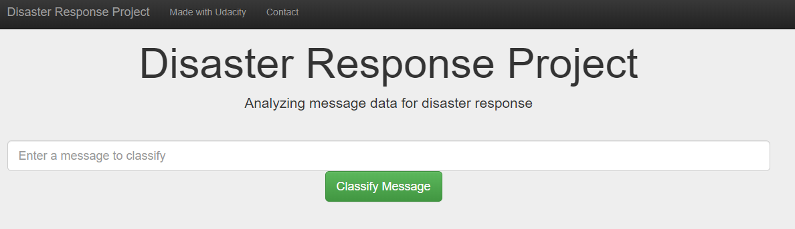

# Disaster Response Pipeline Project
A machine learning pipeline to classify text messages during disaster. 
## Table of Contents
1. [Installation](###installation)
2. [Project Motivation](###project-motivation)
3. [File Descriptions](###file-descriptions)
4. [Deployment](###Deployment)
5. [Results](###Results)
6. [Licensing, Authors, and Acknowledgements](###licensing,-authors,-and-acknowledgements)

### Installation
The code  have the following dependency
* Python3
* Flask
* numpy 
* pandas 
* sklearn
* catboost
* matplotlib libraries

### Project Motivation
This project was a part of Udacity Nano Degree program to build a model for an API that classifies disaster messages.

### File Descriptions
For this purpose, we use [Figure Eight](https://appen.com/). Containing text messages, labeled with different categories.
There two csv datasets from Figure Eight located in the `data` direcctory. `disaster_categories.csv` contains categories of the messages located in `disaster_messages.csv`
the `data` directory also contains the pre processing script for the datasets. The `app` folder contains the Flask web app script. Finally the `model` directory contains the machine learing pipeline and the saved model `classifier.pkl`

### Deployment
1. To preprocess the data run the following command in your `data` directory.
`python process_data.py disaster_messages.csv disaster_categories.csv DisasterResponse`
2. To Train and save your trained model run the following in your `model` direcotry
`python train_classifier.py ../data/DisasterResponse classifier.pkl `
3. Run the following command in the app's directory to run your web app.
    `python run.py`
4. Go to http://0.0.0.0:3001/

### Results
Front Page of the Webapp
 
Message genere distribution
 
Message categories distribution
 

### Licensing, Authors, and Acknowledgements
Credit is due to Udacity Data Scientist NanoDegree Program!
